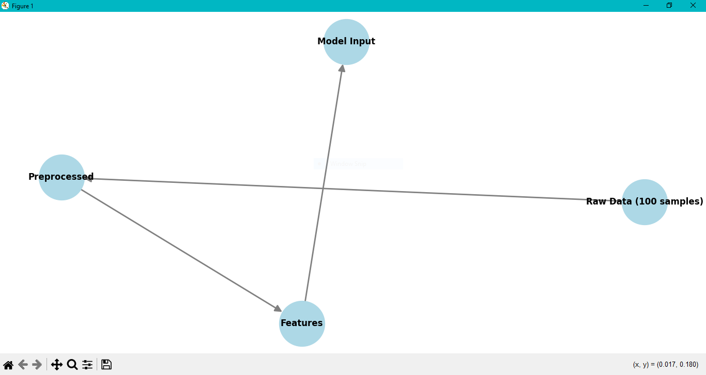
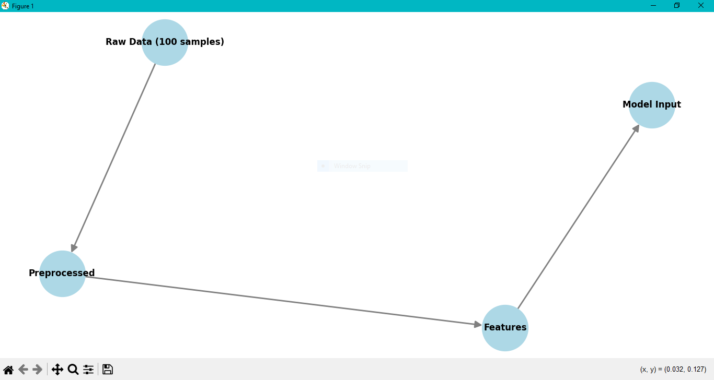

# Sentiment Analysis Lab Manual

This lab demonstrates data flow and bottleneck identification in sentiment analysis pipelines using state graph visualization.

## Overview

This educational lab provides hands-on experience with:
- Data generation for sentiment analysis
- State graph construction and visualization
- Class balance analysis
- Pipeline bottleneck identification

## Features

- **Interactive State Graph**: Visualizes the flow of data through sentiment analysis pipeline stages
- **Class Balance Analysis**: Automatically detects and reports class imbalance issues
- **Bottleneck Identification**: Highlights common pipeline bottlenecks
- **Educational Structure**: Modular code with clear documentation

## Requirements

- Python 3.8+
- matplotlib
- networkx
- scikit-learn
- numpy

## Installation

Install the required packages using pip:

```bash
pip install matplotlib networkx scikit-learn numpy
```

## Usage

Run the lab manual:

```bash
python sentiment_analysis_lab.py
```

## Lab Structure

### 1. Data Generation
- Generates synthetic sentiment data using sklearn's `make_classification`
- Creates 100 samples with balanced positive/negative labels
- Produces text samples for demonstration

### 2. State Graph Visualization
- Creates a directed graph showing pipeline stages:
  - Raw Data → Preprocessed → Features → Model Input
- Uses NetworkX for graph construction and matplotlib for visualization
- Identifies potential bottlenecks in the data flow

### 3. Class Balance Analysis
- Analyzes the distribution of positive/negative samples
- Reports percentages and detects imbalance
- Provides warnings for potential bias issues

### 4. Bottleneck Identification
- Lists common pipeline bottlenecks:
  - Data preprocessing challenges
  - Feature extraction complexity
  - Class imbalance effects
  - Model selection considerations
  - Hyperparameter tuning requirements

## Educational Outcomes

After completing this lab, students will understand:
- How to visualize data flow in ML pipelines
- The importance of class balance in sentiment analysis
- Common bottlenecks in text processing pipelines
- How to identify and address pipeline issues

## File Structure

```
├── sentiment_analysis_lab.py  # Main lab script
└── README.md                  # This documentation
```

## Code Architecture

The lab is structured with modular functions:

- `generate_sentiment_data()`: Creates synthetic sentiment dataset
- `build_state_graph()`: Constructs the pipeline state graph
- `visualize_graph(G)`: Renders the graph visualization
- `analyze_class_balance(labels)`: Performs class distribution analysis
- `identify_bottlenecks()`: Lists pipeline bottlenecks
- `main()`: Orchestrates the entire lab workflow

## Sample Output

The lab produces:
1. **Console Output**: Class balance statistics and bottleneck analysis
2. **Graph Visualization**: Interactive state graph showing pipeline flow

### Example Console Output:
```
SENTIMENT ANALYSIS LAB - STATE GRAPH VISUALIZATION
============================================================
Generating sentiment dataset...

==================================================
CLASS BALANCE ANALYSIS
==================================================
Total samples: 100
Negative samples: 50 (50.0%)
Positive samples: 50 (50.0%)
Dataset is well-balanced
==================================================

==================================================
POTENTIAL BOTTLENECKS
==================================================
- 1. Data Preprocessing: Text cleaning and normalization
- 2. Feature Extraction: Converting text to numerical features
- 3. Class Imbalance: May affect model training
- 4. Model Selection: Choosing appropriate algorithm
- 5. Hyperparameter Tuning: Optimizing model performance
==================================================
```

### Sample Visualizations:

#### Lab Manual Cover


#### State Graph Visualization


#### Analysis Output


## Troubleshooting

### Common Issues:

1. **ModuleNotFoundError**: Install missing packages with pip
2. **Unicode Display Issues**: The code uses plain text for Windows compatibility
3. **Graph Display Issues**: Ensure matplotlib backend is properly configured

### Dependencies:
- All packages are automatically installed via pip requirements
- Tested on Windows 10/11 with Python 3.12

## Extensions

Potential lab extensions:
- Real sentiment dataset integration
- Additional preprocessing stages
- Model performance comparison
- Interactive bottleneck resolution

## License

This educational lab manual is provided for academic use.

## Author

Generated by **Khansa Younas** for educational purposes in sentiment analysis and machine learning pipeline visualization.
